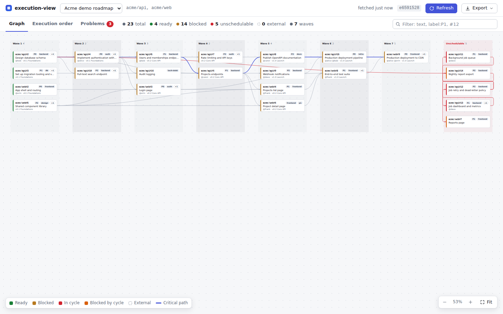
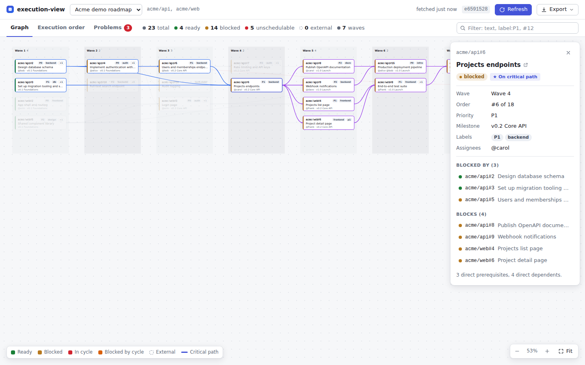
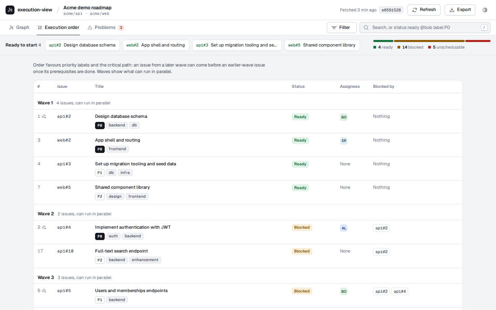
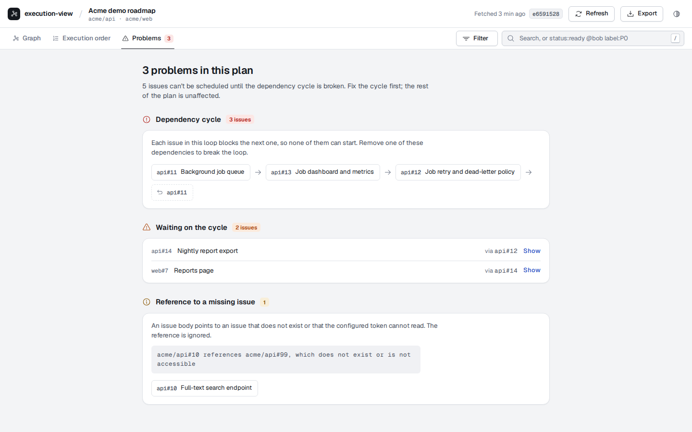
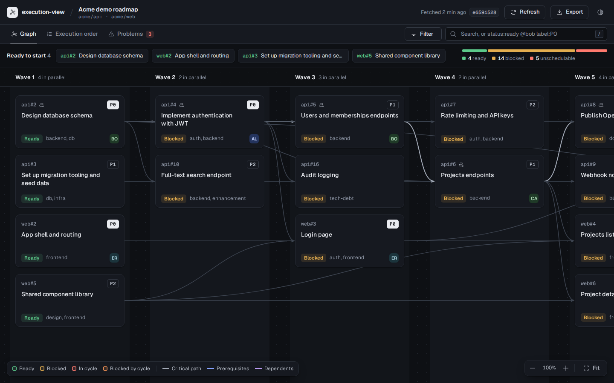

# execution-view

execution-view is a small self-hosted app that reads the **open issues** of your GitHub, GitHub Enterprise Server or Gitea repositories, builds a **dependency graph** from the relations you already declare (native issue dependencies and simple `Depends on #12` lines in issue bodies), and turns it into an **execution order**: what can start now, what can run in parallel, and what blocks everything else. The output is fully deterministic: the same issues always give the same order, the same layout and the same content hash. It has a web UI, a REST API, exports (JSON, Markdown, Mermaid, DOT) and a CLI that checks your setup.



## Features

- **Dependency graph** of open issues across one or more repositories, rendered as layered columns (one column per wave).
- **Execution order with parallel waves**: wave 1 can start now, everything inside a wave can run in parallel, and a linear order breaks ties by priority label.
- **Critical path**: the longest chain of dependencies, which sets the minimum number of sequential steps.
- **Cycle and dangling-reference detection**: circular dependencies and references to issues that do not exist or are not accessible are reported, not hidden.
- **Deterministic output and content hash**: no dependence on API response order, clocks or locale. The hash doubles as an `ETag`. See [docs/DETERMINISM.md](docs/DETERMINISM.md).
- **Exports** to JSON, Markdown, Mermaid and Graphviz DOT.
- **GitHub, GitHub Enterprise Server and Gitea** (Forgejo works through the Gitea provider). The Gitea provider is tested in CI against live instances: Gitea 1.25 and Forgejo 11 (see `scripts/forge-integration.sh`).
- **Docker** image and `docker-compose.yml`; also runs on plain Node.js 22.
- Read-only: it only issues `GET` requests to your tracker.

## Quickstart (demo in 1 minute)

The demo uses a bundled fixture (no network, no token): the "Acme demo roadmap", two repositories with 23 open issues, a cycle and a dangling reference. It only needs Docker:

```sh
docker run --rm -p 8080:8080 -e EV_CONFIG=/app/config.demo.yaml ghcr.io/brunoorsolon/execution-view:1
```

Open <http://localhost:8080>.

Images are published to the GitHub Container Registry for `linux/amd64` and `linux/arm64` on every release: `ghcr.io/brunoorsolon/execution-view:<tag>`, where the tag is the exact version (`1.0.0`), the minor (`1.0`), the major (`1`) or `latest`.

## The web UI

The header has a view selector, the repositories, when the data was fetched, the short content hash, a **Refresh** button (forces a refetch from your tracker), an **Export** menu (JSON, Markdown, Mermaid, DOT) and a theme menu (system, light or dark). Under it: three tabs, the **Filter** menu and the search box. On the Graph and Execution order tabs, a strip lists the issues that are **ready to start**, in execution order, next to a status breakdown.

Issues labelled `agent:claimed` (case-insensitive exact match) show **In progress** instead of **Ready** when they have no open prerequisites. They are excluded from **Ready to start** and `status:ready`, and counted separately in the breakdown. Blocked and cycle statuses take precedence; claimed issues with dependency problems show both their dependency status and an **In progress** badge. `status:in-progress` selects dependency-ready claimed issues; use `label:agent:claimed` to find every claimed issue, including blocked ones. Removing the label and refreshing restores **Ready** if no prerequisites remain. Assignees alone do not imply progress. This is a UI distinction only: dependency planning, API statuses and exports are unchanged.

- **Graph.** One column per wave, plus a red column for unschedulable issues (cycles and what they block). Each card shows the key, the title, the status, the priority label, other labels and the assignees; external issues have a dashed border, and the critical path is drawn as a darker line with a path icon on its cards. It opens at 100% and wave headers stay pinned while you move around. Drag or scroll to pan, Ctrl/Cmd + scroll (or pinch) to zoom, **Fit** or `F` to see everything; zoomed out, cards switch to a compact, status-tinted form. Click an issue to highlight its prerequisites and dependents and open the details panel (status, how many issues it waits on and how many wait on it, wave, position, priority, milestone, assignees, labels, prerequisites and dependents).
- **Execution order.** A table grouped by wave, with the linear order number, a critical-path marker, title and labels, status, assignees and what each issue is blocked by. Clicking a row opens the same details panel.
- **Problems.** Dependency cycles (drawn as a loop), the issues waiting on them, and every other warning, each with an explanation and links to the issues. The tab badge counts the problems.
- **Filter.** One query drives every tab, and issues that do not match are hidden: each wave keeps its matching issues and keeps its number, waves with no match disappear, and a dashed line links two visible issues whose dependency runs through hidden ones. Type text (title or key), `#12`, `owner/repo#12`, or qualifiers: `status:ready` (also `in-progress`, `blocked`, `cycle`, `blocked-by-cycle`, `unschedulable`, `external`), `priority:P0` or `priority:none`, `label:backend`, `@bob` or `assignee:bob`, `milestone:"v1.0 Launch"`, `repo:web`, `is:critical`, `no:assignee` (also `no:milestone`, `no:label`, `no:priority`). Values of one field are alternatives (`status:ready,blocked`), different fields must all match, and a leading `-` excludes (`-label:docs`). The **Filter** menu writes the same qualifiers with checkboxes. Press `/` to focus the search box and `Esc` to leave it or close the details panel. The selected view, tab and filter live in the URL hash (`#/view/<id>/<tab>?q=<query>`), so you can share a link.
- The UI follows your light or dark colour scheme unless you pick one in the theme menu.









## Run it on your repo with docker compose

Read [Before you start: prerequisites](#before-you-start-prerequisites) first: without declared dependencies the graph is empty. You need Docker with Compose v2 (`docker compose version`).

There is no database and nothing to persist: snapshots are cached in memory and fetched again from your tracker after a restart, so no data volume is needed.

**1. Create a folder for it.**

```sh
mkdir execution-view && cd execution-view
```

**2. Create `docker-compose.yml`** with this content (it is also [in the repository](docker-compose.yml), with comments):

```yaml
services:
  execution-view:
    image: ghcr.io/brunoorsolon/execution-view:1.1.0
    container_name: execution-view
    restart: unless-stopped
    ports:
      - '8080:8080'
    environment:
      - EV_PROVIDER=github
      - EV_REPOS=owner/repo,owner/other-repo
      - GITHUB_TOKEN=${GITHUB_TOKEN}
    labels:
      - 'wud.tag.include=^v?\d+\.\d+\.\d+$$'
      - 'wud.tag.exclude=.*(alpha|beta|rc|dev|nightly).*'
```

For Gitea or Forgejo, use these `environment:` lines instead (`EV_BASE_URL` is the instance root, without `/api/v1`):

```yaml
- EV_PROVIDER=gitea
- EV_BASE_URL=https://gitea.example.com
- EV_REPOS=owner/repo
- GITEA_TOKEN=${GITEA_TOKEN}
```

Optional: `- EV_PRIORITY_LABELS=P0,P1,P2` (highest first) and `- EV_BASIC_AUTH=${EV_BASIC_AUTH}` (`user:password`, turns on a login page). Every variable is listed in [docs/CONFIGURATION.md](docs/CONFIGURATION.md#env-only-mode). The `wud.*` labels let [What's Up Docker](https://getwud.github.io/wud/) report new releases; drop them if you do not use it.

If your Gitea runs on the same host behind a reverse proxy and the container cannot reach its public name, map that name to the host's address:

```yaml
extra_hosts:
  - 'gitea.example.com:192.0.2.10'
```

**3. Create `.env`** next to it with the token ([which token?](docs/PREREQUISITES.md#7-tokens-and-permissions)). Docker Compose reads it on its own to fill in `${GITHUB_TOKEN}`; it is not mounted or passed to the container as a whole. Keep it out of Git.

```sh
GITHUB_TOKEN=github_pat_xxx
```

(`GITEA_TOKEN=xxx` for Gitea or Forgejo, and `EV_BASIC_AUTH=user:password` if you enabled it.)

**4. Check the setup** (token, access, declared dependencies):

```sh
docker compose run --rm execution-view check
```

Exit code `0` means everything is fine, `1` a configuration, token or access problem, `2` dependency cycles or references to issues that do not exist; every warning comes with a hint. "0 dependencies" means no dependencies are declared yet (see the prerequisites).

**5. Start it:**

```sh
docker compose up -d
```

Open <http://localhost:8080>.

**6. Upgrade later:** change the image tag to the new version, then:

```sh
docker compose pull && docker compose up -d
```

Images are tagged with the exact version (`1.1.0`), the minor (`1.1`), the major (`1`) and `latest`. Use `:1` instead of a pinned version if you prefer to follow every 1.x release without editing the file.

### Several repositories, views or options: the config file

Env-only mode gives one view on one tracker (`EV_REPOS` can still list several repositories, comma-separated). For several views, GitHub and Gitea together, scope filters, GitHub Enterprise Server, webhooks or the wave-by-wave ordering, use a config file: create `config.yaml` next to `docker-compose.yml` ([`config.example.yaml`](config.example.yaml) shows every option).

The config never holds the tokens: `tokenEnv` names the environment variable that does, so you can commit `config.yaml` and keep only `.env` out of Git.

**Several repositories on one tracker.** Every repository in a view is planned together, so dependencies between them are followed:

```yaml
sources:
  - id: gt
    kind: gitea
    baseUrl: https://gitea.example.com
    tokenEnv: GITEA_TOKEN

views:
  - id: platform
    title: Platform
    source: gt
    repos:
      - acme/api
      - acme/web
      - acme/infra
    ordering:
      priorityLabels: [P0, P1, P2]
```

For separate graphs on the same tracker, add more views with the same `source`. A prerequisite that lives in another view's repository still appears, as an external issue.

**GitHub and Gitea together.** One source per tracker, and one view (or more) per source: a view plans repositories of a single source. Switch between views with the selector in the header.

```yaml
sources:
  - id: gh
    kind: github
    tokenEnv: GITHUB_TOKEN
  - id: gt
    kind: gitea
    baseUrl: https://gitea.example.com
    tokenEnv: GITEA_TOKEN

views:
  - id: self-hosted
    title: Self-hosted (Gitea)
    source: gt
    repos:
      - acme/api
      - acme/web
  - id: open-source
    title: Open source (GitHub)
    source: gh
    repos:
      - acme/sdk
      - acme/docs
```

The first view opens by default. Dependencies between a GitHub issue and a Gitea issue are not followed.

**In the compose file**, remove the `EV_*` lines, keep one token line per source, and mount the config:

```yaml
environment:
  - GITHUB_TOKEN=${GITHUB_TOKEN}
  - GITEA_TOKEN=${GITEA_TOKEN}
volumes:
  - ./config.yaml:/app/config.yaml:ro
```

with both tokens in `.env`. Create `config.yaml` **before** adding the mount: if the file does not exist, Docker creates a directory with that name. Then run `docker compose run --rm execution-view check`, which reports each view separately. Every option is documented in [docs/CONFIGURATION.md](docs/CONFIGURATION.md); deployment recipes (plain `docker run`, systemd, reverse proxy, login, webhooks) are in [docs/DEPLOYMENT.md](docs/DEPLOYMENT.md).

### Without Docker

Requires Node.js 22 or newer and a clone of the repository:

```sh
npm ci && npm run build && EV_CONFIG=config.demo.yaml npm start
```

That starts the demo; for your repositories set the same `EV_*` variables (or `EV_CONFIG=config.yaml`) instead.

## Before you start: prerequisites

The app can only show what your issues declare. In short:

- [ ] Your dependencies are declared **natively** (GitHub "Relationships", Gitea "Dependencies") and/or as **lines in the issue body**, such as `Depends on #12`. Mid-sentence prose is deliberately ignored.
- [ ] You have a **read-only token** that can read every repository involved, including repositories that are only referenced from another one.
- [ ] Native dependencies are **available** on your platform (a setting that must be enabled on Gitea; possibly missing on older GitHub Enterprise Server versions). If not, use body lines only.
- [ ] You know that only **open** issues are shown, and a **closed** issue never blocks anything.

The full explanation, the accepted and rejected syntax, token permissions, API usage and a verification checklist are in **[docs/PREREQUISITES.md](docs/PREREQUISITES.md)**. Verify your setup at any time with `docker compose run --rm execution-view check` (or `node dist/cli/index.js check` from a source checkout).

## Documentation

| Document                                       | What is in it                                                                                       |
| ---------------------------------------------- | --------------------------------------------------------------------------------------------------- |
| [docs/PREREQUISITES.md](docs/PREREQUISITES.md) | What the app reads, how to declare dependencies, tokens, rate limits, warning codes and a checklist |
| [docs/CONFIGURATION.md](docs/CONFIGURATION.md) | Every config option and environment variable, with complete examples                                |
| [docs/DEPLOYMENT.md](docs/DEPLOYMENT.md)       | Docker, docker-compose, bare Node, systemd, reverse proxy, login, security, upgrading               |
| [docs/DETERMINISM.md](docs/DETERMINISM.md)     | The guarantees, the exact ordering rules, the content hash                                          |
| [docs/API.md](docs/API.md)                     | HTTP endpoints, headers, snapshot schema, curl examples                                             |
| [docs/ARCHITECTURE.md](docs/ARCHITECTURE.md)   | The implementation contract (for contributors)                                                      |

## CLI

The CLI reads the same config as the server (`--config <path>`, then `EV_CONFIG`, then `./config.yaml`, then env-only mode). After `npm run build` it is `node dist/cli/index.js` (also installed as the `execution-view` bin; the Docker image uses it as its entrypoint).

| Command                                                      | What it does                                                                                       |
| ------------------------------------------------------------ | -------------------------------------------------------------------------------------------------- |
| `serve`                                                      | Start the HTTP server and web UI (the default command of the Docker image)                         |
| `views [--json]`                                             | List the configured views                                                                          |
| `plan <viewId> [-f md\|json\|mermaid\|mmd\|dot] [-o <file>]` | Fetch the view and print the plan (default format `md`, default output stdout)                     |
| `check [viewId...] [--json]`                                 | Validate the config, fetch the views, report cycles and dangling references (all views by default) |

`check` exit codes: `0` everything fine, `1` configuration error, unknown view or fetch failure, `2` cycles or dangling references found. Example against the demo:

```sh
node dist/cli/index.js -c config.demo.yaml check
```

```text
✖ demo (Acme demo roadmap) · fixture · acme/api, acme/web
  23 issues · 4 ready · 14 blocked · 5 unschedulable · 0 external · 34 dependencies · 7 waves
  ⚠ blocked-by-cycle: 2 issues are blocked by a dependency cycle: acme/api#14, acme/web#7
    hint: these issues wait on an issue that is part of a cycle; resolve the cycle first and they will be scheduled
  ✖ cycle: Dependency cycle: acme/api#11 → acme/api#12 → acme/api#13
    hint: break the cycle by removing one of these dependencies (a `Depends on` / `Blocked by` line in an issue body, or a native dependency in the tracker)
  ✖ dangling-reference: acme/api#10 references acme/api#99, which does not exist or is not accessible
    hint: check the issue number and the repo name in the reference, and that the token can read that repo (a typo, a deleted issue and a missing access right all look the same to the API)
```

The demo has problems on purpose, so this run exits with code `2`.

## Development

```sh
npm ci
```

```sh
npm run typecheck && npm test && npm run format:check
```

`npm run build` compiles the server to `dist/` and the web UI to `dist/web/`.

## Releasing

1. Set the new version in `package.json` and `package-lock.json` (`npm version 1.2.3 --no-git-tag-version`), and optionally write release notes in `.github/release-notes/v1.2.3.md`. Merge that to `main`.
2. Start the release, either way:
   - in GitHub: **Actions → Release → Run workflow** on `main`, with **version** `1.2.3`. The workflow creates the tag `v1.2.3` on that commit;
   - or push a tag: `git tag v1.2.3 && git push origin v1.2.3`.

The [Release workflow](.github/workflows/release.yml) runs the checks and the Docker smoke test, verifies that the version matches `package.json`, publishes the multi-arch image to `ghcr.io/brunoorsolon/execution-view` (`1.2.3`, `1.2`, `1` and `latest`; prereleases such as `1.3.0-rc.1` never move `latest`) and creates the GitHub Release. Publishing a release from the GitHub UI works too (the image is published; the release already exists). Run workflow with an empty version is a dry run that builds the image without pushing anything.

## License

[MIT](LICENSE)
